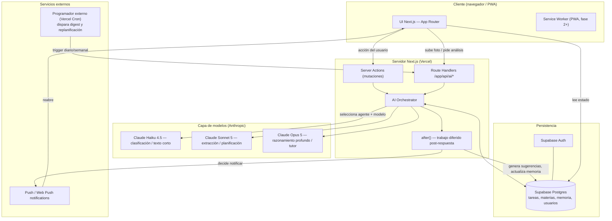
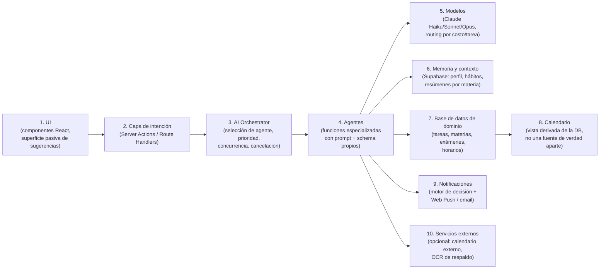
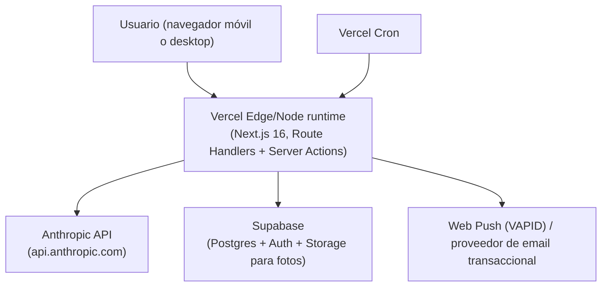

# Parte 3 — Arquitectura general

> Documento 2 de 12. Ver [README.md](./README.md) para el índice completo.

## 3.1 Punto de partida real (no greenfield teórico)

Esta arquitectura no se diseña en el vacío: se diseña sobre un repositorio concreto cuyo estado actual es relevante porque determina qué es un "añadido" y qué es una "reescritura":

- `app/page.tsx` concentra hoy el 100% de la lógica de la aplicación, en el cliente, hablando directo con Supabase mediante la clave anónima pública.
- No existe `app/api/`, no existen Server Actions, no existe `proxy.ts` (el antiguo middleware, renombrado en Next.js 16), no existe autenticación, no existe un esquema de tipos compartido (`Materia`/`Tarea` están duplicados a mano en seis archivos).
- Next.js 16.2.11 (App Router, React 19) sí ofrece todo lo necesario para construir el backend de IA sin salir del framework: **Route Handlers** (`app/api/.../route.ts`) para endpoints invocables desde el cliente o desde servicios externos (webhooks, cron); **Server Actions** para mutaciones iniciadas desde formularios/UI que necesitan lógica de servidor; **`after()`** para encolar trabajo que se ejecuta tras enviar la respuesta al usuario (clave para IA "en segundo plano" sin bloquear la interacción); y **Cache Components / `use cache`** para cachear salidas no sensibles al usuario.

**Consecuencia de diseño explícita:** introducir IA en Agenda+ significa introducir, por primera vez en el proyecto, un límite de servidor real. Esto no es opcional ni pospoñible — la clave de API de Anthropic (`ANTHROPIC_API_KEY`) no puede vivir en una variable `NEXT_PUBLIC_*` como las actuales de Supabase; debe vivir solo en el servidor. Esto obliga a mover al menos las operaciones de escritura de `tareas`/`materias` detrás de Route Handlers o Server Actions (hoy se hacen directo desde el navegador), porque los agentes de IA necesitan poder leer y escribir esas tablas desde el servidor con el mismo modelo de datos que ve el usuario.

## 3.2 Diagrama de arquitectura de extremo a extremo

Puntos que este diagrama fija como decisión, no como boceto:

1. **El Orchestrator vive en el servidor, nunca en el cliente.** El cliente nunca llama directamente a la API de Anthropic ni conoce las claves. Esto es innegociable por seguridad (una clave de Anthropic expuesta en el navegador es equivalente a regalar presupuesto de inferencia a quien inspeccione el bundle) y por control de costos (cuotas de freemium, Parte 18, solo se pueden hacer cumplir en servidor).
2. **`after()` es el mecanismo central de "IA en segundo plano".** Cuando el usuario crea una tarea o sube una foto, la respuesta al usuario (tarea creada, foto recibida) se devuelve de inmediato; el trabajo de IA (clasificar, extraer, decidir si vale la pena notificar) ocurre en `after()`, fuera de la ruta crítica de latencia percibida. Esto es lo que hace que la IA "no se sienta" — el usuario no espera un spinner de 3 segundos para que se guarde una tarea.
3. **No existe cron nativo en Next.js.** La replanificación nocturna y el dígest matutino (Parte 14) requieren un disparador externo — Vercel Cron (`vercel.json` con `crons: [...]` apuntando a un Route Handler) es la opción por defecto dado que el equipo es de una persona y ya se usará Vercel como plataforma de despliegue natural para Next.js. No se introduce infraestructura de colas/workers propia en la Fase 1.
4. **Autenticación deja de ser opcional.** El modelo freemium (cuotas por usuario), la memoria por usuario (Parte 8) y el aislamiento de datos (hoy todo es una tabla global sin `user_id`) exigen Supabase Auth desde el momento en que se introduce IA — se documenta como prerequisito de la Fase 1 en el roadmap (Parte 21), no como mejora futura.

## 3.3 Capas del sistema (vista lógica)

Nota de diseño sobre la capa 8: **el calendario no es un sistema separado con su propia base de datos** — es una proyección de las tablas `tareas`/`materias`/`examenes` filtradas por fecha. Esto evita un problema clásico de estas apps (MyStudyLife lo sufre): dos fuentes de verdad que se desincronizan. Cualquier integración futura con Google Calendar (fase 3+) es una sincronización de salida, no una fuente de entrada primaria.

## 3.4 Por qué no Managed Agents (CMA) de Anthropic

Es una decisión de arquitectura explícita y se justifica aquí porque condiciona todo lo que sigue (Orchestrator, catálogo de agentes, costos).

Anthropic ofrece dos formas de construir "agentes" sobre Claude:

| Opción | Qué es | Encaja cuando... |
|---|---|---|
| **Managed Agents (CMA)** | Anthropic aloja el loop del agente y un contenedor sandbox por sesión (bash, archivos, ejecución de código) | El agente necesita explorar de forma abierta, ejecutar código, mantener una sesión larga con estado de contenedor — el caso de uso típico es un agente de codificación o de investigación autónoma |
| **Messages API + tool use / structured outputs** | Cada "agente" es una función de servidor: un prompt + (opcionalmente) herramientas + un schema de salida forzado, orquestada por código propio | La tarea es acotada, de entrada/salida bien definida, se ejecuta en milisegundos-segundos, y el control de costo/latencia/reintentos debe vivir en el propio código de la app |

Los agentes de Agenda+ (Parte 5) son del segundo tipo: extraer una fecha de una foto, clasificar una tarea, generar 5 flashcards, decidir si conviene notificar. Ninguno necesita un sandbox de archivos ni una sesión de horas. Usar CMA aquí sería:

- **Más caro y más lento** — cada sesión de CMA aprovisiona un contenedor; para una llamada de "clasifica esta tarea" eso es sobreingeniería.
- **Más complejo de operar para un equipo de una persona** — CMA introduce conceptos (agentes versionados, entornos, vaults, sesiones con ciclo de vida propio) que no aportan nada a un caso de uso de petición-respuesta corta.
- **Una dependencia beta innecesaria** — la superficie estable (Messages API, `output_config.format` para salidas estructuradas, tool use, prompt caching, Batch API) ya resuelve el 100% de los casos del catálogo de agentes sin depender de una API en beta.

**Conclusión:** el "AI Orchestrator" de la Parte 4 es un módulo de servidor escrito por nosotros (TypeScript, corriendo en Route Handlers / `after()`), no una capa sobre CMA. CMA queda anotado como opción a revisar solo si en el futuro se necesitara un agente verdaderamente autónomo y de sesión larga (por ejemplo, un "asistente de investigación" que navegue múltiples fuentes durante minutos) — no está en el roadmap de las primeras fases (Parte 21).

## 3.5 Diagrama de despliegue (vista física, Fase 1)

Todo el sistema corre sobre dos proveedores gestionados (Vercel + Supabase) más la API de Anthropic — coherente con la restricción de equipo de una sola persona: cero servidores propios, cero orquestación de contenedores, cero modelos autoalojados en la Fase 1 (se retoma en la Parte 10, local vs. cloud, y en la Parte 20, escalabilidad).

## 3.6 Qué cambia respecto al código actual (resumen técnico, sin implementar aún)

Para que quede trazable frente al estado real del repo relevado:

1. Se introduce `app/api/ai/*` (Route Handlers) y/o Server Actions para todas las mutaciones que hoy hace `app/page.tsx` directo a Supabase — necesario porque el Orchestrator necesita ser la puerta de entrada única a "algo pasó, decide si la IA actúa".
2. Se introduce un esquema de tipos compartido (`lib/types.ts`) — hoy duplicado en 6+ archivos — como prerequisito de higiene antes de que los agentes empiecen a leer/escribir estas estructuras.
3. Se introduce Supabase Auth y una columna `user_id` en las tablas de dominio — hoy inexistente, todo es global.
4. Se introduce una tabla/esquema de memoria (Parte 8) y una tabla de eventos de IA (para el registro de qué se le comunicó al usuario y cuándo, requerido por el marco de no-redundancia de la Parte 2.4).

Ninguno de estos puntos se implementa en este documento — se listan porque el roadmap (Parte 21) los sitúa como Fase 0/1 antes de que exista el primer agente.
