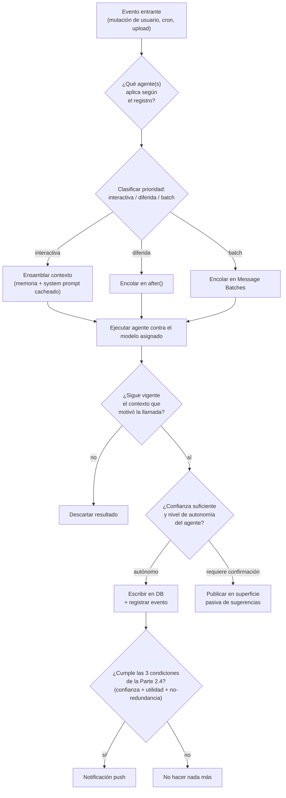

# Parte 4 — El AI Orchestrator

> Documento 3 de 12. Ver [README.md](./README.md) para el índice completo.

## 4.1 Qué es y qué no es

El Orchestrator es el único componente del sistema que decide **qué agente ejecutar, cuándo, con qué modelo, con qué prioridad, y si el resultado debe llegar al usuario o quedarse en silencio**. No es un framework, no es un producto de terceros, no es CMA (Parte 3.4) — es un módulo de servidor (TypeScript) que vive dentro de la app Next.js y se invoca desde Route Handlers, Server Actions y el disparador de cron.

Su responsabilidad se puede resumir en una función conceptual:

```
decidir(evento, contexto_usuario) → { ejecutar: Agente[] | ninguno, prioridad, modelo, canal_de_salida }
```

Todo evento del sistema (usuario crea tarea, usuario sube foto, cron dispara "fin de día", usuario completa tarea) pasa por esta decisión antes de que se gaste un solo token de inferencia.

## 4.2 Responsabilidades detalladas

### 4.2.1 Selección de agente

El Orchestrator mantiene un **registro de agentes** (Parte 5) con metadatos declarativos por agente: qué eventos lo disparan, qué entrada necesita, qué modelo usa por defecto, coste estimado, y si requiere confirmación del usuario antes de aplicar su salida (por ejemplo, el Calendar Agent puede crear una tarea automáticamente con alta confianza, pero debe pedir confirmación si la confianza es media — ver 4.2.5).

La selección no es 1:1 evento→agente. Un solo evento ("foto subida") puede requerir una cadena: OCR Agent → Homework/Exam Agent (comprensión) → Calendar Agent (creación) → Reminder Agent (registro de recordatorio). El Orchestrator resuelve esa cadena como un grafo de dependencias declarado por agente ("requiere salida de: OCR Agent"), no como lógica ad hoc repetida en cada Route Handler.

### 4.2.2 Priorización

No todos los eventos son iguales. El Orchestrator clasifica cada disparo en una de tres colas conceptuales:

| Cola | Ejemplos | Latencia objetivo | Modelo por defecto |
|---|---|---|---|
| **Interactiva** | Usuario sube una foto y espera ver la tarea extraída en pantalla | Debe resolverse mientras el usuario mira la UI — segundos | Sonnet 5 (o Haiku si la tarea es trivial) |
| **Diferida (`after()`)** | Clasificar una tarea recién creada, decidir si conviene generar una sugerencia | No bloquea la respuesta al usuario, se resuelve en el mismo request-response de servidor tras devolver la respuesta | Haiku 4.5 por defecto |
| **Por lotes (batch/cron)** | Replanificación nocturna de la semana, generación de flashcards de un PDF grande, dígest matutino | Minutos a horas, no interactiva | Sonnet 5, vía Message Batches (Parte 9) para abaratar costo |

Esta clasificación es la que determina si una llamada usa la Messages API síncrona, `after()`, o la Batch API — decisión de costo y de arquitectura de Next.js, no solo de UX.

### 4.2.3 Memoria y contexto

El Orchestrator es responsable de **ensamblar el contexto que cada agente recibe**, no cada agente por su cuenta — esto evita que cada agente reimplemente su propia lógica de "qué necesito saber del usuario" y permite controlar el tamaño/costo del contexto de forma centralizada (ver Parte 7 para el diseño detallado de qué entra en ese contexto y cómo se mantiene acotado).

En términos de la Messages API esto se traduce directamente en la estrategia de **prompt caching** (Parte 9): el Orchestrator arma el `system` prompt de cada tipo de agente como un bloque estable (cacheable, con `cache_control: ephemeral`) seguido del contexto variable del usuario. El orden de ensamblado (system fijo → contexto de usuario → petición puntual) no es un detalle de implementación, es una decisión de costo: invertir el orden anula el cacheo y encarece cada llamada.

### 4.2.4 Cancelación

Un agente en curso debe poder cancelarse cuando deja de tener sentido completarlo — ejemplos: el usuario edita manualmente la tarea mientras el Homework Agent todavía está extrayéndola de una foto; el usuario marca la tarea como completada mientras el Planning Agent está recalculando la semana. El Orchestrator implementa esto mediante:

- Un `AbortController` por invocación de agente, propagado a la llamada a la API de Anthropic (todas las SDKs de Anthropic soportan cancelación de la petición HTTP en curso).
- Un chequeo de "¿sigue siendo válido este resultado?" inmediatamente antes de escribir en la base de datos — si el estado relevante cambió entre el inicio y el fin de la llamada, el resultado se descarta en vez de sobrescribir un cambio más reciente del usuario. Esto es más importante que cancelar la llamada en sí (que solo ahorra costo): escribir un resultado obsoleto sobre una edición del usuario sería un bug de confianza grave (viola el principio de la Parte 2 de nunca imponerse sobre la intención explícita del usuario).

### 4.2.5 Concurrencia y niveles de autonomía

No todos los agentes tienen el mismo permiso para actuar sin supervisión. El Orchestrator aplica tres niveles, declarados por agente y ajustables por confianza de la inferencia:

| Nivel | Comportamiento | Ejemplo |
|---|---|---|
| **Autónomo** | Escribe directamente en la base de datos, sin pedir confirmación | Reminder Agent decidiendo la ventana de una notificación ya autorizada por el usuario |
| **Autónomo con reversión fácil** | Escribe, pero deja un registro explícito y un botón de "deshacer" visible en la UI | Calendar Agent creando una tarea desde una foto con confianza alta |
| **Sugerido, requiere confirmación** | No escribe; genera una propuesta que aparece en la superficie pasiva (Parte 2.4) hasta que el usuario la acepta o descarta | Planning Agent proponiendo reordenar la semana completa; Calendar Agent con confianza media-baja en la fecha extraída |

El umbral de confianza que mueve un resultado de "autónomo" a "requiere confirmación" es un parámetro del Orchestrator, no del agente individual — esto permite ajustarlo globalmente (por ejemplo, subir el umbral general si se detecta una tasa de correcciones manuales alta, ver Parte 17) sin tocar cada agente.

Sobre concurrencia técnica: el Orchestrator limita cuántas invocaciones de agentes corren en paralelo por usuario (evitar que una carga masiva de fotos dispare N llamadas simultáneas y reviente la cuota de rate-limit de Anthropic o el presupuesto de costo del usuario freemium) y por deployment (límite global de gasto, ver Parte 18).

## 4.3 Diagrama de flujo de decisión



## 4.4 Registro de agentes (contrato)

Cada agente se registra ante el Orchestrator con un contrato declarativo mínimo — esto es lo que permite añadir agentes nuevos (Parte 21, roadmap) sin tocar el núcleo del Orchestrator:

- `id` — identificador único del agente.
- `eventosDisparadores` — qué eventos del sistema lo activan.
- `dependeDe` — qué otros agentes deben haber corrido antes (para cadenas como OCR → Homework Agent).
- `modeloPorDefecto` / `modeloAlternativo` — routing de modelo (Parte 9), incluyendo el modelo de fallback si el principal rehúsa o excede cuota.
- `esquemaDeSalida` — el JSON Schema que se exige vía `output_config.format` (salidas estructuradas), de forma que la salida del agente sea siempre parseable y validable antes de tocar la base de datos.
- `nivelDeAutonomia` — uno de los tres niveles de 4.2.5, con el umbral de confianza correspondiente.
- `presupuestoDeCoste` — límite de tokens/costo por invocación, usado para decidir si un usuario free ha agotado su cuota para ese agente (Parte 18).

## 4.5 Por qué esto no es "solo un prompt bien escrito"

Es tentador pensar que un buen system prompt reemplaza al Orchestrator. No es así, y es importante justificarlo: un prompt no puede decidir cancelación, no puede hacer cumplir cuotas de costo por usuario, no puede decidir qué modelo usar según el tipo de tarea, y no puede garantizar que la salida sea válida antes de escribirla en la base de datos. El Orchestrator es la capa de **ingeniería de sistemas** alrededor del modelo; el prompt (dentro de cada agente) es la capa de **ingeniería de comportamiento**. Confundir ambas es la razón por la que muchas integraciones de IA en apps terminan siendo frágiles — este documento las separa desde el diseño.
