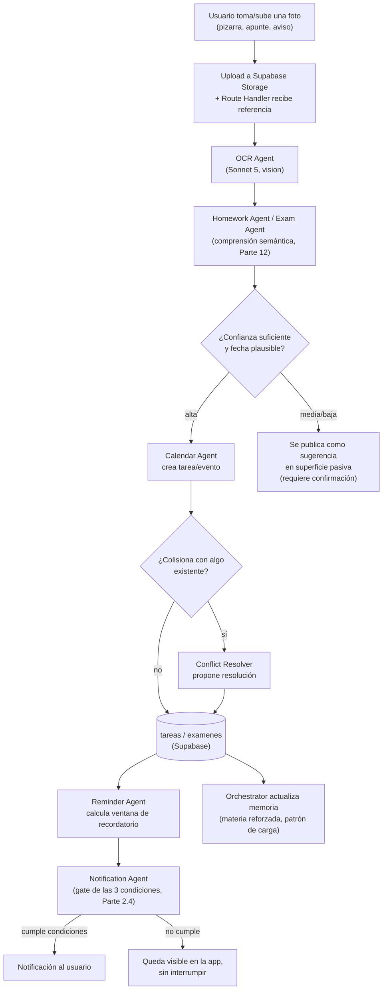
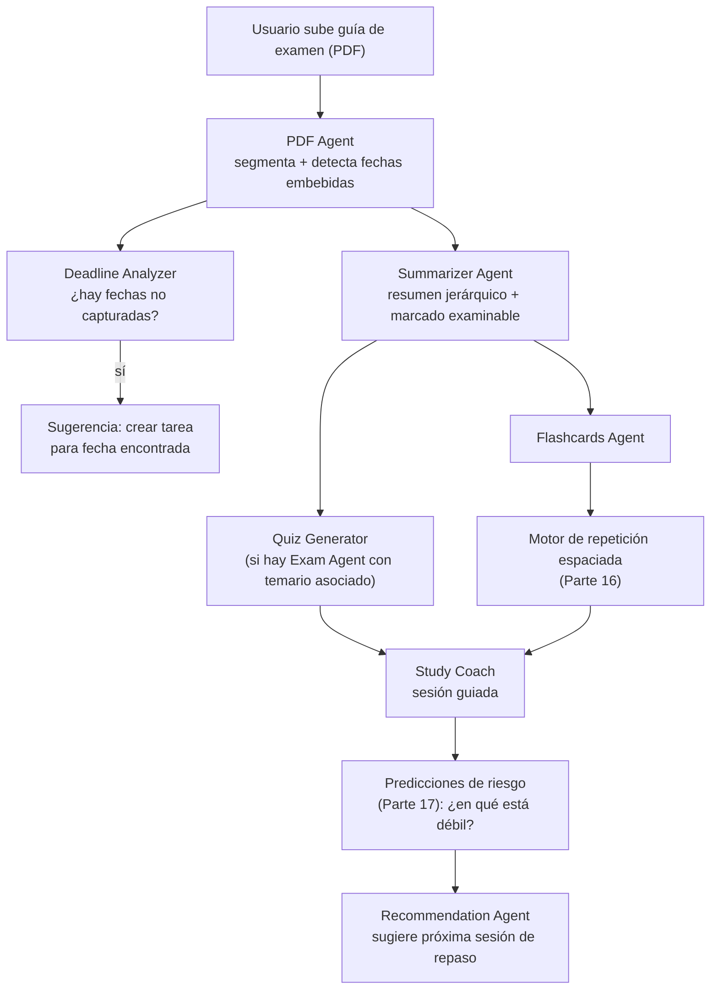
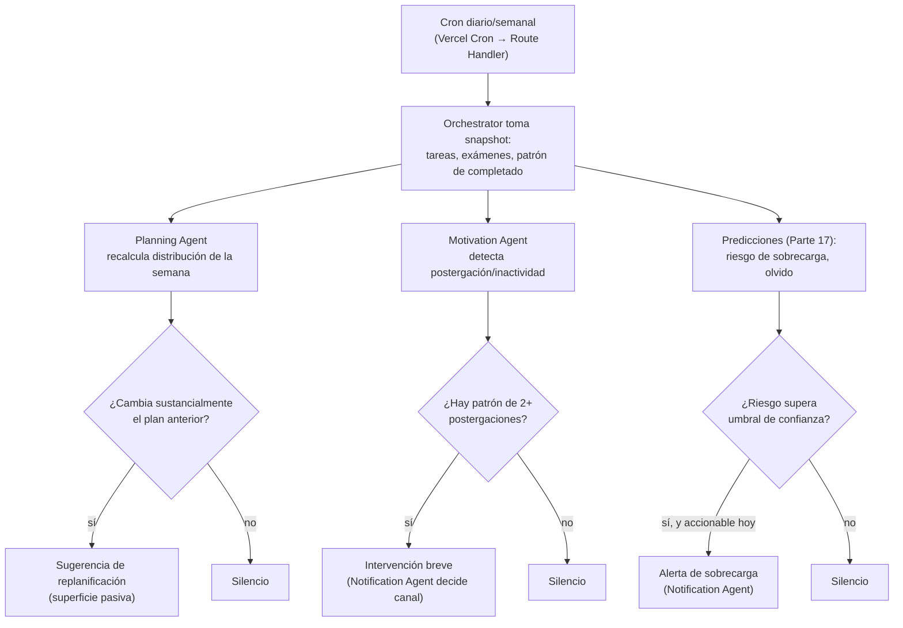

# Parte 6 — Flujo de información

> Documento 5 de 12. Ver [README.md](./README.md) para el índice completo.

## 6.1 Por qué esto merece su propio documento

El catálogo de agentes (Parte 5) describe cada pieza en aislamiento. Lo que determina si el sistema se siente inteligente o se siente como una colección de funciones desconectadas es **cómo fluye la información entre agentes, base de datos, calendario, recordatorios y memoria** — este documento traza los tres flujos punta a punta más representativos del sistema.

## 6.2 Flujo 1 — De foto a recordatorio (el flujo insignia, categoría A de la Parte 1)

Puntos de diseño que este flujo fija:

1. **La confianza se evalúa dos veces, no una**: primero al extraer (Homework/Exam Agent declara su propia confianza), y de nuevo al decidir el nivel de autonomía (Parte 4.2.5). Esto evita que un agente "seguro de sí mismo" pero equivocado escriba directo a la base de datos.
2. **El registro de memoria ocurre siempre**, incluso cuando el resultado termina como sugerencia sin confirmar — porque el patrón en sí (ej. "el usuario fotografía la pizarra de Física todos los lunes") es información útil para el Orchestrator aunque la tarea puntual no se haya creado todavía.
3. **El camino hasta la notificación es largo a propósito**: pasa por Reminder Agent (decide si debería existir un recordatorio) y luego por Notification Agent (decide si y cómo comunicarlo ahora). Nunca un agente notifica directamente — esto es lo que impide que cinco agentes generen cinco notificaciones independientes por un solo evento.

## 6.3 Flujo 2 — De documento largo a sesión de estudio (categoría D→E)

Este flujo es deliberadamente **asíncrono y de baja prioridad de cómputo**: el Summarizer, Flashcards y Quiz Generator de un documento largo no necesitan responder en segundos — se ejecutan vía Batch API (Parte 9) salvo que el usuario esté esperando activamente en la UI (ej. pidió "resume este PDF ahora"). La diferencia con el Flujo 1 (foto→recordatorio, que sí es mayormente interactivo) es clave para el diseño de costos (Parte 18): el 50% de descuento de Batch API se aplica exactamente a este tipo de flujo.

## 6.4 Flujo 3 — Del tiempo que pasa a la proactividad (categoría C, sin evento de usuario)

Este es el flujo que no tiene un disparador de usuario — nace del cron y de la observación pasiva de la base de datos, y es el que más distingue a Agenda+ de una app reactiva.

El resultado por defecto de cada rama es **silencio** — se dibuja explícitamente en el diagrama porque es la ruta más frecuente en un sistema bien calibrado (Parte 2.4: la mayoría de los días, no debería pasar nada visible). Solo las ramas que superan su respectivo umbral llegan a generar contenido, y ese contenido pasa siempre por el Notification Agent antes de decidir el canal de entrega.

## 6.5 Principio transversal: la IA aprende contexto en cada flujo, no solo al final

En los tres flujos, el paso de "actualizar memoria" no es un paso final aislado — ocurre en paralelo a la acción principal (ver el nodo `MEM` en el Flujo 1). Esto es intencional: si la memoria solo se actualizara al completar todo el flujo, un flujo interrumpido (usuario cierra la app a medio proceso, o el resultado se descarta por baja confianza) perdería información de contexto que igual era valiosa (ej. "el usuario fotografía habitualmente los lunes" es cierto aunque esa foto en particular no haya generado una tarea). El diseño detallado de qué se guarda y cómo se resume se cubre en la Parte 8.
