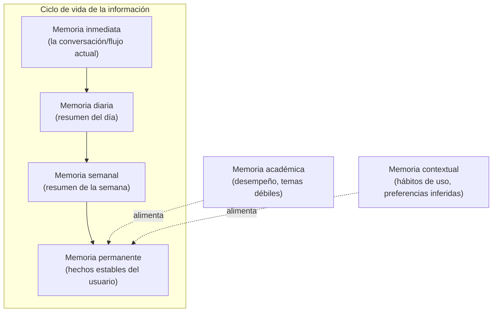

# Parte 7-8 — Contexto y memoria

> Documento 6 de 12. Ver [README.md](./README.md) para el índice completo.

## Parte 7 — Contexto: qué recordar y cómo mantenerlo acotado

### 7.1 El problema de fondo

Un LLM no tiene memoria entre llamadas — cada invocación es stateless. Todo lo que "la IA recuerda" sobre un estudiante es, en la práctica, texto que el Orchestrator decide incluir en el prompt de cada llamada. El diseño de contexto es, por tanto, un problema de **selección**: qué subconjunto de todo lo que se sabe del usuario vale la pena pagar en tokens en esta llamada específica.

### 7.2 Categorías de contexto

| Categoría | Ejemplos | Volatilidad | ¿Dónde vive? |
|---|---|---|---|
| **Identidad académica** | Materias inscritas, profesores, nivel (colegio/universidad/posgrado), carrera | Baja — cambia por semestre | Tabla `materias`, `perfil_academico` |
| **Horario estructural** | Horario de clases recurrente, horas de estudio declaradas disponibles | Baja-media — cambia por semestre o por aviso puntual | Tabla `horario` (mantenida por Class Schedule Agent) |
| **Estado operativo** | Tareas pendientes, exámenes próximos, tareas vencidas | Alta — cambia constantemente | Tablas `tareas`/`examenes` (fuente de verdad ya existente en el dominio) |
| **Hábitos y preferencias** | Hora del día en la que suele estudiar, tolerancia a notificaciones, ritmo de completado | Media — se actualiza por inferencia continua, no por input directo | Tabla `memoria_habitos` (Parte 8) |
| **Historial de aprendizaje** | Desempeño en quizzes/flashcards por tema, temas débiles detectados | Media | Tabla `memoria_academica` (Parte 8) |

### 7.3 Regla de ensamblado de contexto por agente

No todos los agentes necesitan todas las categorías. El Orchestrator (Parte 4.2.3) ensambla el contexto según lo que el agente declara necesitar en su contrato — esto evita el antipatrón de "meter todo el perfil del usuario en cada prompt porque por si acaso":

- **Calendar Agent** necesita identidad académica (para evitar duplicar materias) + estado operativo (para detectar colisiones). No necesita historial de aprendizaje.
- **Study Coach** necesita historial de aprendizaje + identidad académica. No necesita el horario estructural completo.
- **Reminder Agent** necesita hábitos (tolerancia a notificaciones, hora habitual de estudio) + estado operativo de esa tarea puntual. No necesita nada del historial de aprendizaje.

Esta segmentación cumple dos objetivos a la vez: reduce costo (menos tokens de contexto por llamada) y reduce ruido (un modelo con contexto irrelevante razona peor, no solo más caro).

### 7.4 Contexto estable vs. contexto variable — la relación con prompt caching

Dentro de cada categoría, se distingue explícitamente lo que es **estable dentro de una sesión de uso** (identidad académica, horario) de lo que es **variable en cada llamada** (estado operativo del momento, la petición puntual). Esta distinción no es cosmética: determina el orden de ensamblado del prompt para maximizar el aprovechamiento del prompt caching de Anthropic (desarrollado en la Parte 9) — el bloque estable va primero y se marca con `cache_control`, el bloque variable va al final, después del punto de corte de caché. Invertir este orden anula el ahorro de costo sin que haya ningún beneficio de calidad a cambio.

### 7.5 Límite de tamaño de contexto — por qué no "meter todo"

Con ventanas de hasta 1M tokens en los modelos actuales de Claude, sería técnicamente posible enviar el historial completo del usuario en cada llamada. Se descarta deliberadamente por tres razones:

1. **Costo**: el precio se paga por token de entrada en cada llamada, incluso con caché (que reduce, pero no elimina, el costo del contexto cacheado). Un contexto que crece sin límite hace que el costo por interacción crezca con el tiempo de vida del usuario — inviable para el modelo freemium (Parte 18).
2. **Precisión**: contexto irrelevante compite por la atención del modelo con la información que sí importa para la tarea puntual — un LLM con 50 páginas de historial de tareas viejas responde peor a "¿cuándo es mi examen de mañana?" que uno con el contexto filtrado a lo relevante.
3. **Latencia**: más tokens de entrada, aun con caché, añaden latencia de procesamiento — relevante en el camino interactivo (Parte 4.2.2).

La solución no es "contexto ilimitado" sino **memoria resumida por niveles**, que es exactamente el tema de la Parte 8.

---

## Parte 8 — Memoria: tipos, qué guardar, qué olvidar, cómo resumir

### 8.1 Los seis tipos de memoria

| Tipo | Qué contiene | Cómo se genera | Cómo expira |
|---|---|---|---|
| **Inmediata** | El estado de la interacción en curso (ej. los pasos ya dados en una sesión de Study Coach) | Se mantiene en el propio historial de mensajes de esa llamada/sesión | Se descarta al terminar la interacción; no persiste |
| **Diaria** | Resumen de qué pasó hoy: tareas creadas, completadas, pospuestas; fotos procesadas | Generado por un agente de resumen ligero al final del día (batch, Haiku 4.5) | Se conserva ~30 días para detectar patrones de corto plazo, luego se compacta en la memoria semanal |
| **Semanal** | Resumen agregado: carga de la semana, cumplimiento del plan del Planning Agent, materias con más actividad | Generado a partir de las memorias diarias de esa semana (batch) | Se conserva ~un semestre, luego se compacta en memoria permanente si hay señal relevante, o se descarta |
| **Permanente** | Hechos estables: materias del semestre actual, profesores, preferencias explícitas del usuario (ej. "no notificar después de las 22:00") | Se escribe por eventos explícitos (usuario configura una preferencia) o por confirmación repetida de un patrón inferido | No expira automáticamente; se actualiza cuando cambia (nuevo semestre, nueva preferencia) |
| **Académica** | Desempeño en quizzes/flashcards por tema, temas identificados como débiles, historial de estimaciones de tiempo vs. tiempo real | Se actualiza tras cada sesión de Study Coach / Quiz Generator | Se conserva mientras la materia esté activa; se archiva (no se borra, salvo pedido del usuario) al finalizar el semestre |
| **Contextual** | Patrones de uso inferidos: hora habitual de estudio, tolerancia a notificaciones, velocidad de respuesta a sugerencias | Se actualiza de forma continua por el Orchestrator observando interacciones (aceptar/rechazar sugerencias, hora de apertura de la app) | Se recalcula con ventana móvil (últimas ~8-12 semanas), sin acumular indefinidamente |

### 8.2 Qué guardar — criterio explícito

Se guarda solo lo que cumple **al menos una** de estas condiciones:
- Cambia una decisión futura de algún agente (ej. saber que el usuario suele estudiar de noche cambia cuándo el Reminder Agent programa notificaciones).
- Evita repetir una pregunta o una extracción ya resuelta (ej. una vez que el usuario confirma el nombre correcto de una materia, no se le vuelve a preguntar).
- Alimenta una predicción (Parte 17) — el historial de tiempo estimado vs. real es el insumo directo de la calibración de Time Estimation Agent.

### 8.3 Qué olvidar — criterio explícito

Se descarta o se compacta (nunca se acumula indefinidamente) lo que:
- Es específico de un evento puntual ya resuelto y sin valor predictivo (ej. el texto crudo exacto de una foto de pizarra, una vez extraída y confirmada la tarea — se conserva la tarea estructurada, no el OCR crudo, salvo que el usuario quiera revisar la imagen original, que queda en Storage, no en el contexto de memoria).
- Ha sido contradicho por información más reciente (ej. un horario de clases viejo, una vez que el Class Schedule Agent confirma el cambio).
- Pertenece a un semestre/periodo académico cerrado y el usuario no ha indicado interés en conservarlo (se archiva de forma fría, fuera del contexto activo, coherente con el derecho de portabilidad/eliminación de la Parte 19).

### 8.4 Cómo se resumen las conversaciones/interacciones

El proceso de compactación (diaria → semanal → permanente) no es una simple concatenación de texto — es en sí mismo una tarea de un agente ligero (Haiku 4.5, ejecutado en batch): recibe el conjunto de eventos del período y produce un resumen de longitud acotada (ej. máximo ~200 tokens para el resumen semanal), priorizando hechos accionables sobre narrativa. Esto es deliberadamente análogo al mecanismo de compactación que ofrece la propia plataforma de Anthropic para conversaciones largas, pero aplicado al dominio de la app (resumir *actividad del usuario en la app*, no una conversación de chat con el modelo) — se implementa como un agente propio, no como una función de la API de mensajes, porque lo que se resume no es un historial de conversación sino una traza de eventos de la aplicación.

### 8.5 Aislamiento por usuario

Toda la memoria (los seis tipos) se almacena con `user_id` explícito y nunca se comparte entre usuarios ni se usa para entrenar o mejorar modelos de terceros — esto se retoma como requisito no negociable en la Parte 19 (privacidad), pero se declara aquí porque condiciona el propio esquema de las tablas de memoria desde el diseño de datos, no como una política añadida después.
