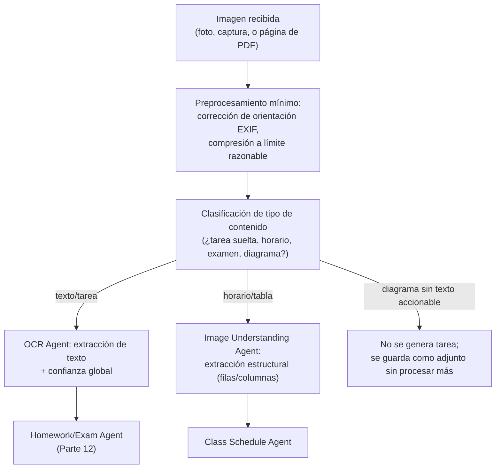
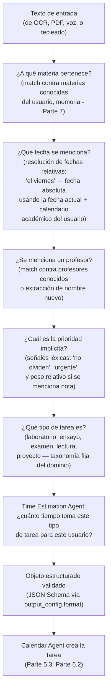

# Parte 11-12 — OCR inteligente y comprensión semántica

> Documento 8 de 12. Ver [README.md](./README.md) para el índice completo.

## Parte 11 — OCR extremadamente inteligente

### 11.1 Qué debe reconocer, y por qué cada tipo es distinto

El usuario listó explícitamente: fotografías, tableros/pizarras, PDFs, guías, apuntes, capturas de pantalla, escritura manual, horarios, calendarios, tablas, diagramas. No son variaciones triviales de "una imagen con texto" — cada tipo tiene un modo de fallo distinto que el pipeline debe anticipar:

| Tipo de entrada | Dificultad específica | Implicación de diseño |
|---|---|---|
| Fotografía de pizarra | Perspectiva angular, reflejos, letra de profesor apresurada, texto parcialmente borrado | Requiere modelo de visión que tolere degradación, no OCR de plantilla fija |
| Apunte manuscrito propio | Caligrafía muy variable entre personas, abreviaturas propias del estudiante | El modelo debe apoyarse en contexto (materias conocidas del usuario) para desambiguar, no solo en la imagen |
| PDF de guía/examen | Texto nativo generalmente limpio, pero largo y con estructura (secciones, tablas, listas) | No es un problema de OCR sino de extracción + segmentación (PDF Agent, Parte 5.2) |
| Captura de pantalla (ej. de un mensaje de WhatsApp o Classroom) | Texto nítido pero mezclado con interfaz (burbujas de chat, iconos) | El modelo debe distinguir contenido del "chrome" de la interfaz |
| Horario/calendario en tabla | Estructura bidimensional (filas=días, columnas=horas, o viceversa) donde la posición espacial *es* el dato | Requiere comprensión espacial, no solo lectura lineal de texto — ver Image Understanding Agent |
| Diagramas (ej. de una materia de ciencias) | El contenido relevante no es texto sino relaciones visuales | Fuera del alcance de "extracción de tareas"; se documenta como límite conocido, no se fuerza una interpretación forzada de un diagrama como si fuera una tarea |

### 11.2 Pipeline elegido: visión de LLM directa, no un motor de OCR clásico + post-proceso

**Decisión:** en la Fase 1, el pipeline de OCR de Agenda+ es una única llamada al modelo de visión de Claude (Sonnet 5) que recibe la imagen y produce directamente texto extraído + metadatos de estructura, en lugar de un pipeline clásico de dos etapas (motor OCR tradicional tipo Tesseract → texto plano → LLM para interpretar).

**Justificación:**
- Un motor de OCR clásico está optimizado para texto impreso limpio; falla notablemente en manuscritos y en fotos con perspectiva/iluminación irregular — exactamente los casos más comunes en el uso real de un estudiante (pizarra, apunte propio).
- Separar "leer" de "entender" en dos pasos pierde información: un LLM de visión puede usar el layout (una fecha destacada en una esquina, una palabra subrayada) como señal de importancia al mismo tiempo que lee — un pipeline de dos etapas donde el segundo paso solo ve texto plano pierde esa señal espacial.
- El costo de una sola llamada de visión (Sonnet 5) es aceptable en el volumen de la Fase 1 y se controla con el análisis de la Parte 18; si el volumen creciera lo suficiente como para que el costo por imagen sea un problema, la Parte 9.4 ya documenta la palanca de desacoplar OCR tradicional + LLM solo para comprensión como optimización futura — no se adopta preventivamente sin necesidad probada.

### 11.3 Pipeline detallado

El paso de **clasificación de tipo de contenido** es explícito y previo a la extracción — evita que el sistema intente forzar una estructura de "tarea con fecha" sobre una imagen que en realidad es un diagrama sin ninguna fecha ni compromiso, que es un modo de fallo real (alucinar una fecha donde no hay ninguna) si se salta este paso.

### 11.4 Manejo de confianza y ambigüedad

Cada salida del OCR Agent incluye un campo de confianza (no un simple booleano "éxito/fallo") que se propaga aguas abajo hasta la decisión de autonomía del Orchestrator (Parte 4.2.5). Casos explícitos:

- **Confianza alta** (texto nítido, coincide con el patrón esperado de una tarea): se permite creación autónoma con reversión fácil.
- **Confianza media** (parte del texto es ambiguo, ej. una fecha con un dígito poco claro): se marca la tarea como sugerida, y la UI debe mostrar la porción de imagen ambigua junto al campo dudoso para que la corrección del usuario sea de un clic, no de reescribir todo.
- **Confianza baja o contenido irreconocible**: no se genera ninguna estructura; se informa al usuario que la imagen no pudo procesarse, sin inventar una interpretación.

Esto es la aplicación directa, a nivel de OCR, del principio de la Parte 2.3: "nunca finge certeza que no tiene".

---

## Parte 12 — Comprensión: de texto a tarea estructurada

### 12.1 El salto de "extraer" a "entender"

El ejemplo que da el propio usuario es el correcto marco de referencia:

> "No olviden entregar el laboratorio el viernes." → Materia → Fecha → Profesor → Prioridad → Tipo → Tiempo estimado → Crear tarea automáticamente

Extraer el texto literal ("no olviden entregar el laboratorio el viernes") no es útil por sí mismo — la utilidad viene de la inferencia estructurada. Este es el trabajo central del **Homework Agent** (Parte 5.3), y aquí se especifica el pipeline interno que ese agente ejecuta.

### 12.2 Pipeline de comprensión

### 12.3 Por qué esto se implementa como una sola llamada con salida estructurada, no como una cadena de seis prompts

Es tentador implementar cada flecha del diagrama de 12.2 como una llamada independiente al modelo ("¿qué materia es?", luego "¿qué fecha es?", etc.). Se descarta deliberadamente:

- **Costo:** seis llamadas pequeñas pagan seis veces la latencia de red y pierden la ventaja del prompt caching de contexto compartido (Parte 9.3) que sí se aprovecha en una sola llamada con el `system` prompt cacheado.
- **Coherencia:** un modelo que resuelve las seis inferencias en un solo paso de razonamiento puede usar información cruzada (ej. si el tipo de tarea es "examen", eso informa la prioridad por defecto; una cadena de prompts aislados no comparte ese contexto entre pasos salvo que se reenvíe manualmente, lo cual anula el ahorro de la separación en primer lugar).
- **Salidas estructuradas ya resuelven el problema que la cadena de prompts intentaría evitar**: forzar el esquema de salida (JSON Schema con campos `materia`, `fecha`, `profesor`, `prioridad`, `tipo`, `tiempo_estimado`, cada uno con su propio sub-campo de confianza) en una sola llamada da exactamente la misma estructura final, validada por el servidor de Anthropic antes de que la respuesta llegue al Orchestrator — sin la complejidad de encadenar seis llamadas.

**Única excepción:** el Time Estimation Agent (paso M6) sí es una consulta separada, porque su fuente de información (historial de tiempos reales del usuario, Parte 7.2) es distinta de lo que el texto de la tarea puede decir por sí mismo — no es una inferencia lingüística sino una consulta a datos propios, coherente con por qué ese agente usa Haiku 4.5 y no participa del mismo prompt de comprensión semántica.

### 12.4 Resolución de fechas relativas — el detalle que más falla en la práctica

"El viernes" no es una fecha — es una referencia que depende de: la fecha en la que se creó la mención (si la nota es de una foto tomada hoy, "el viernes" es el próximo viernes; si es un PDF fechado hace tres semanas, podría ser un viernes ya pasado, señal de que el documento es antiguo) y del calendario académico del usuario (si "el viernes" cae en un feriado o periodo de receso conocido, es una señal de posible error de comprensión que debe bajar la confianza, no resolverse en silencio).

**Regla de diseño:** toda fecha relativa se resuelve usando la fecha de captura del evento de origen (metadato de cuándo se tomó la foto o se subió el documento), nunca la fecha en la que el agente procesa la solicitud (que puede ser minutos o hass después por la cola de `after()`/batch) — un desfase aquí es la causa más común de errores de "la IA puso mal la fecha" en sistemas similares, y se previene fijando explícitamente cuál es la fecha de referencia en el prompt, no dejándolo implícito.

### 12.5 Validación antes de escribir

Ninguna salida del Homework/Exam Agent se escribe en la base de datos sin pasar por una validación determinística (no otra llamada al modelo, sino código de servidor simple) que rechaza casos imposibles:

- Fecha resuelta en el pasado (salvo que el tipo de tarea sea explícitamente retroactivo, ej. registrar una nota ya obtenida).
- Materia que no coincide con ninguna materia conocida del usuario ni es razonablemente una materia nueva (ej. una cadena de texto sin sentido como nombre de materia) — en ese caso se marca como confianza baja y pasa a sugerencia, no a creación automática.
- Tipo de tarea fuera de la taxonomía fija del dominio.

Esta capa de validación determinística es barata, rápida, y es la última línea de defensa antes de que una alucinación del modelo se convierta en una tarea falsa en el calendario del estudiante — un costo de confianza que el producto no puede permitirse (Parte 2, Parte 22).
