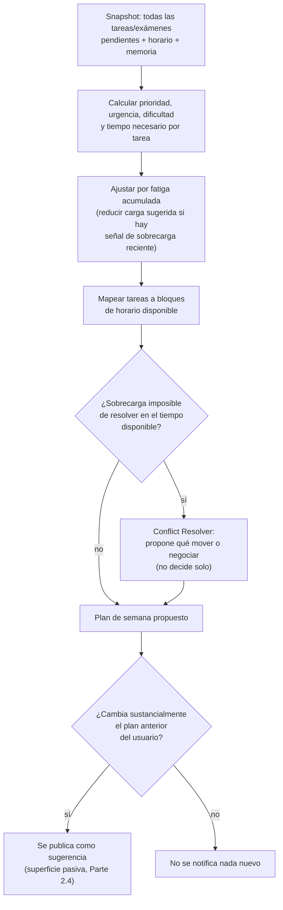
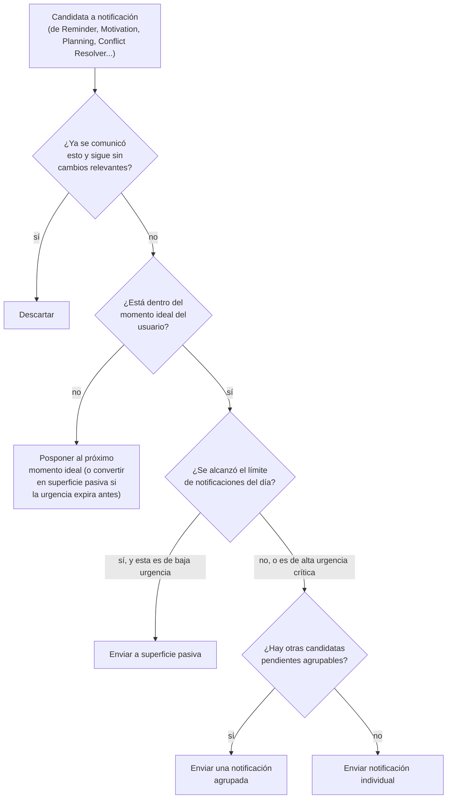

# Parte 13-15 — Planificación automática, IA proactiva y notificaciones inteligentes

> Documento 9 de 12. Ver [README.md](./README.md) para el índice completo.

## Parte 13 — Replanificación automática de la semana

### 13.1 Las variables que hay que calcular, y por qué ninguna es trivial

El usuario pide que se calculen automáticamente: prioridad, urgencia, dificultad, tiempo necesario, fatiga, horarios disponibles, eventos. Cada una merece una definición operacional explícita — sin eso, "calcular la prioridad" es una frase vacía que ningún prompt por sí solo resuelve de forma confiable.

| Variable | Definición operacional | Fuente de datos |
|---|---|---|
| **Prioridad** | Combinación de peso académico declarado (si se conoce, ej. "vale 30% de la nota") y tipo de tarea (un examen pesa más por defecto que una lectura) | Exam Agent (peso), taxonomía fija de tipo de tarea |
| **Urgencia** | Función inversa del tiempo restante hasta la fecha límite, ajustada por el tiempo estimado que toma la tarea (una tarea de 3 horas con fecha en 2 días es más urgente que una de 30 minutos con la misma fecha) | Fecha de la tarea (Calendar Agent) + Time Estimation Agent |
| **Dificultad** | Estimación cualitativa (baja/media/alta) inferida del tipo de tarea, la materia, y el historial de desempeño del usuario en esa materia (Parte 8, memoria académica) — no es una propiedad fija de la tarea, es relativa al estudiante | Memoria académica + tipo de tarea |
| **Tiempo necesario** | Salida directa del Time Estimation Agent (Parte 5.4), con rango de confianza, no un número puntual | Time Estimation Agent |
| **Fatiga** | Proxy indirecto: carga acumulada de tareas de alta dificultad/urgencia en los últimos días, y tasa reciente de postergación (señal de que el usuario está sobrecargado) — **no** se infiere de señales biométricas ni de dispositivo (no disponibles en Web/PWA, Parte 10) | Memoria contextual (Parte 8) — patrón de actividad reciente |
| **Horarios disponibles** | Bloques del día no ocupados por el horario de clases (Class Schedule Agent) ni por horas de estudio ya comprometidas, respetando las horas de estudio declaradas por el usuario en sus preferencias | Horario estructural (Parte 7.2) |
| **Eventos** | Compromisos no académicos que el usuario haya registrado (si Agenda+ los soporta) que reducen el tiempo disponible real | Calendario del usuario |

### 13.2 El pipeline del Planning Agent

### 13.3 Por qué el plan nunca se aplica de forma silenciosa

El Planning Agent tiene nivel de autonomía "sugerido" (Parte 4.2.5, Parte 5.9) de forma deliberada: reordenar el trabajo académico de una persona sin su consentimiento explícito, aunque sea con buena intención algorítmica, viola el principio de la Parte 2 de que la IA apoya, no impone. El plan se presenta siempre como propuesta editable, nunca como un hecho consumado — el usuario puede aceptar el plan completo, aceptar partes, o descartarlo, y esa decisión (aceptar/rechazar) se registra en la memoria contextual (Parte 8) como señal de calibración futura (si el usuario rechaza sistemáticamente los planes de fin de semana, el Planning Agent debe aprender a no proponerlos).

---

## Parte 14 — IA proactiva sin ser molesta

### 14.1 El problema de diseño central de esta parte

Ya se estableció en la Parte 2.4 el marco de las tres condiciones (confianza + utilidad + no-redundancia) y los dos canales (empujar vs. dejar disponible). Esta parte lo aplica de forma concreta a los ejemplos que el propio usuario propuso: "Detecté que tienes tres exámenes esta semana", "Conviene estudiar hoy", "Estás atrasado", "Puedes terminar esto antes".

### 14.2 Clasificación de cada ejemplo contra el marco

| Ejemplo del usuario | ¿Cumple las 3 condiciones? | Canal recomendado |
|---|---|---|
| "Detecté que tienes tres exámenes esta semana" | Confianza alta (hecho verificable contra la base de datos, no una inferencia probabilística) + utilidad alta (cambia cómo planea la semana) + no redundante si es la primera vez que se le informa | **Empujar**, una sola vez al detectar el patrón — no repetir cada día de esa semana |
| "Conviene estudiar hoy" | Depende: solo es útil si hay una razón concreta detrás (examen próximo, plan del Planning Agent para hoy) — sin esa razón es relleno prohibido (Parte 2.4) | **Dejar disponible** salvo que la razón concreta tenga urgencia alta (ej. examen mañana), en cuyo caso se **empuja** con la razón explícita, nunca genérica |
| "Estás atrasado" | Requiere alta confianza en que efectivamente hay una tarea vencida y accionable — fácil de verificar contra la base de datos | **Empujar** si la tarea vencida tiene consecuencia próxima (entrega que aún se puede hacer tarde vs. una que ya no tiene sentido); si no hay nada que el usuario pueda hacer ya, no se notifica (viola la condición de utilidad accionable) |
| "Puedes terminar esto antes" | Es una sugerencia de reordenamiento, similar al Planning Agent — nunca de alta urgencia por sí sola | **Dejar disponible** exclusivamente — nunca justifica una interrupción push |

### 14.3 Mecanismo anti-fatiga de notificación

Más allá de las tres condiciones por evento individual, existe un control agregado: un límite de notificaciones push por día/semana (configurable por el usuario, con un valor por defecto conservador), gestionado centralmente por el Notification Agent (Parte 5.8) — ningún otro agente puede saltarse este límite. Si en un día se acumulan más candidatas a notificación de las que el límite permite, el Notification Agent prioriza por urgencia real (examen mañana > sugerencia de reordenar el jueves) y descarta o pospone el resto a la superficie pasiva.

### 14.4 Relación con la confianza estadística (adelanto de la Parte 17)

El umbral de "confianza suficiente" de las tres condiciones no es un número arbitrario fijado una vez — se calibra con el tiempo usando la tasa de aceptación/corrección del usuario sobre sugerencias pasadas (memoria contextual, Parte 8). Si el sistema nota que sus sugerencias de "conviene estudiar hoy" son descartadas sistemáticamente por un usuario particular, el umbral efectivo para ese usuario sube — es decir, la IA se vuelve más conservadora y más silenciosa con quien no responde bien a ese tipo de intervención, en vez de insistir. Esto se desarrolla formalmente en la Parte 17.

---

## Parte 15 — Notificaciones inteligentes

### 15.1 Por qué un recordatorio "normal" no es suficiente

Un recordatorio tradicional (X días/horas antes, fijo por prioridad) es exactamente lo que ya existe hoy en `NotificationBell.tsx` del propio proyecto (ventana fija de 1/2/3 días según prioridad baja/media/alta). Es un punto de partida razonable pero no es "inteligente" — no considera nada del contexto del usuario. Esta parte define qué variables adicionales sí debe considerar el Reminder/Notification Agent.

### 15.2 Variables de decisión

| Variable | Cómo se usa |
|---|---|
| **Momento ideal** | Se infiere de la memoria contextual (Parte 8): hora habitual en la que el usuario suele abrir la app o completar tareas — evitar notificar a las 3am o durante el horario de clase conocido del usuario (Class Schedule Agent) |
| **Frecuencia** | Gobernada por el límite anti-fatiga de la Parte 14.3, ajustable por el usuario |
| **Contexto** | Si ya existe una notificación pendiente de la misma tarea sin resolver, no se apila una segunda con la misma información — se actualiza o se suprime la anterior (registro de eventos comunicados, Parte 2.4, no-redundancia) |
| **Ubicación** | **No disponible en la Fase 1** (Web/PWA sin permisos de geolocalización persistente como los tendría una app nativa) — se documenta como señal futura de fase nativa, no como funcionalidad actual |
| **Uso del teléfono** | **No disponible en la Fase 1** por la misma razón de plataforma (Parte 10.2) — en una app nativa futura, señales como "pantalla bloqueada hace tiempo" podrían informar el momento ideal |
| **Estrés** | No se infiere de señales biométricas (no disponibles); se aproxima indirectamente con el proxy de fatiga ya definido en 13.1 (carga acumulada + tasa de postergación) — un estudiante con alta carga y baja tasa de completado reciente recibe notificaciones más espaciadas y de tono más neutro, no más frecuentes con tono de urgencia (evitar empeorar la sensación de agobio) |
| **Prioridad** | Determina no solo la ventana de anticipación (heredado de la lógica actual) sino también si la notificación puede agruparse con otras de menor prioridad en un solo resumen, o debe ir individual |

### 15.3 Decisión de agrupación — evitar el "spam de notificaciones individuales"

Cuando múltiples eventos de baja/media urgencia coinciden en una ventana corta de tiempo, el Notification Agent los agrupa en una sola notificación de resumen ("3 tareas de esta semana necesitan atención") en lugar de enviar una por evento — esto es una decisión explícita de UX que reduce la fatiga de notificación sin perder la información, y es responsabilidad exclusiva del Notification Agent (ningún otro agente decide agrupación, para evitar lógica duplicada e inconsistente).

### 15.4 Diagrama de decisión del Notification Agent

Esta parte, junto con la 13 y la 14, forma el núcleo de lo que hace que Agenda+ se sienta "inteligente" en el sentido que pide la Parte 2 — y es, no por casualidad, la parte con más lógica determinística de todo el documento: la inteligencia proactiva bien calibrada depende tanto de buen juicio de producto (los umbrales, los límites) como del modelo de lenguaje en sí.
