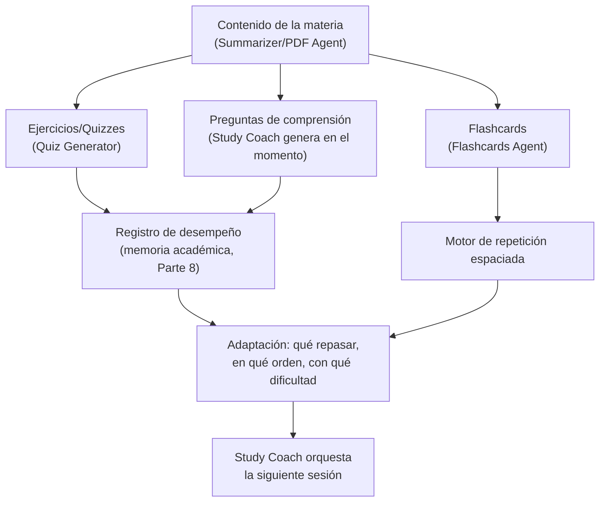

# Parte 16-17 — Tutor inteligente y predicciones

> Documento 10 de 12. Ver [README.md](./README.md) para el índice completo.

## Parte 16 — Tutor inteligente (Study Coach)

### 16.1 El principio rector: enseñar, no responder

El usuario es explícito: "No quiero respuestas. Quiero aprendizaje." Esto tiene una consecuencia de diseño directa y no negociable para el Study Coach (Parte 5.7): **el agente está prohibido de resolver directamente un ejercicio de examen o escribir un ensayo por el estudiante**, incluso si se le pide explícitamente. Su modo de operación por defecto es socrático — responde con preguntas que guían al estudiante hacia la respuesta, no con la respuesta misma.

Esto no es solo una postura ética — es una decisión de producto con justificación de retención: un estudiante que usa la IA para "hacer trampa" obtiene una sensación de progreso falsa que se revela como falsa en el examen real; ese fracaso predecible es exactamente el tipo de experiencia que hace que un estudiante abandone la app. El tutor socrático, aunque requiera más esfuerzo del estudiante en el momento, es la única versión del producto que genera resultados académicos reales y por tanto retención genuina.

### 16.2 Los componentes pedagógicos y cómo se relacionan

### 16.3 Preguntas y ejercicios

El Study Coach no genera preguntas al azar — las deriva del contenido específico que el estudiante subió (PDF, apuntes, resumen), priorizando las secciones que el Summarizer Agent marcó como "alta probabilidad de examen" (Parte 5.6). Las preguntas siguen una progresión deliberada: primero de recuerdo simple (¿qué es X?), luego de aplicación (¿cómo usarías X en este caso?), luego de síntesis (¿cómo se relaciona X con Y, visto antes?) — evitando quedarse solo en el nivel más fácil de generar (memorización literal), que es el modo de fallo típico de un generador de preguntas ingenuo.

### 16.4 Quizzes

Generados por el Quiz Generator (Parte 5.6) a partir del temario detectado por el Exam Agent. Cada pregunta incluye una explicación breve de la respuesta correcta (no solo "correcto/incorrecto") — esto es lo que convierte al quiz en una herramienta de aprendizaje y no solo de evaluación, y es la señal que retroalimenta directamente el registro de desempeño (16.6).

### 16.5 Flashcards y repetición espaciada

El Flashcards Agent (Parte 5.6) genera las tarjetas; el motor de repetición espaciada es lógica determinística (no un agente de IA en sí) que decide cuándo volver a mostrar cada tarjeta, siguiendo el principio bien establecido de que el intervalo de repaso debe crecer cuando el estudiante responde bien y acortarse cuando responde mal. La IA participa en dos puntos: generando las tarjetas de calidad (preguntas que fuerzan recuperación activa, no reconocimiento pasivo) y, através del Study Coach, decidiendo cuándo es un buen momento para insertar una sesión de repaso dentro del plan general (conectando con el Planning Agent, Parte 13).

### 16.6 Explicaciones y adaptación

Cuando el estudiante falla una pregunta o pide ayuda, el Study Coach no repite la explicación genérica del material — genera una explicación adaptada al error específico cometido (si el estudiante confundió dos conceptos, la explicación se centra en la diferencia entre esos dos, no en repetir la definición completa de ambos desde cero). Esto requiere que el prompt del Study Coach reciba, además del contenido de la materia, el registro específico de la interacción fallida — es la razón por la que este agente usa Opus 5 (Parte 9.3): la calidad del razonamiento pedagógico adaptativo importa más aquí que en cualquier otro agente del catálogo.

### 16.7 Límite de cuota en el tier gratis

Dado que Opus 5 es el modelo más costoso del catálogo (Parte 9.3) y el Study Coach es interactivo (no se puede diferir a batch sin romper la experiencia de una sesión de estudio en vivo), es el agente donde el límite de cuota freemium (Parte 18) tiene más impacto de diseño directo — se especifica ahí, pero se declara aquí como restricción de producto: el tier gratuito ofrece un número acotado de sesiones de Study Coach por semana; el resto del catálogo (captura, planificación, recordatorios) permanece disponible sin ese límite estricto porque corre en modelos más baratos.

---

## Parte 17 — Predicciones

### 17.1 Qué puede predecir Agenda+, y con qué honestidad estadística

El usuario pide explícitamente: probabilidad de olvidar, riesgo de reprobar, tiempo restante, sobrecarga, rendimiento — "con confianza estadística". Esto exige distinguir, desde el diseño, entre una predicción respaldada por datos reales del propio usuario y una que sería pura especulación del modelo de lenguaje presentada como si fuera un cálculo — lo segundo es exactamente el tipo de "falsa certeza" prohibido en la Parte 2.3.

| Predicción | Fuente de señal real | Nivel de confianza posible |
|---|---|---|
| **Probabilidad de olvidar una tarea** | Historial del propio usuario: tareas similares (mismo tipo, misma materia, misma ventana de recordatorio) que fueron olvidadas/completadas tarde en el pasado | Alta una vez que existe historial suficiente (mínimo de observaciones); **no disponible con confianza para un usuario nuevo** — se declara explícitamente en vez de inventar un número |
| **Riesgo de sobrecarga** | Cálculo directamente derivado de las variables ya definidas en la Parte 13 (urgencia + tiempo necesario + horario disponible) — es más un cálculo determinístico que una predicción probabilística | Alta — es aritmética sobre datos conocidos, no inferencia estadística débil |
| **Tiempo restante** | Cálculo directo (fecha límite menos fecha actual, ajustado por tiempo estimado de trabajo pendiente) | Alta — dato determinístico |
| **Riesgo de reprobar / rendimiento** | Requiere historial de notas reales del usuario (si el usuario las registra) combinado con el registro de desempeño en quizzes/flashcards (memoria académica, Parte 8) | Media, y **solo si el usuario ha proporcionado suficientes datos de notas reales** — sin eso, no se ofrece esta predicción en absoluto, en vez de basarla únicamente en el desempeño de práctica (que correlaciona pero no equivale al desempeño real de examen) |
| **Fatiga** | Proxy indirecto ya definido en la Parte 13.1 (carga + tasa de postergación reciente) | Media-baja por naturaleza — se comunica siempre como una señal cualitativa ("pareces sobrecargado esta semana"), nunca como un porcentaje falsamente preciso |

### 17.2 Regla de oro: nunca mostrar un número sin base suficiente

Si no hay suficientes observaciones históricas del usuario para una predicción dada (umbral mínimo definido por tipo de predicción, ej. al menos varias tareas similares completadas u olvidadas en el pasado antes de ofrecer "probabilidad de olvidar"), el sistema **no muestra la predicción en absoluto** en lugar de mostrar un valor por defecto poco fiable. Esto es consistente con el principio de silencio de la Parte 2.4: mejor no decir nada que decir algo falsamente preciso.

### 17.3 Cómo se usan las predicciones — nunca como fin en sí mismas

Ninguna predicción se muestra como un dato aislado y curioso — cada una debe conectarse a una acción posible, coherente con el criterio de utilidad accionable (Parte 2.4):

- "Riesgo de sobrecarga alto esta semana" → dispara al Conflict Resolver / Planning Agent a proponer una redistribución (Parte 13), no se queda como una alerta sin salida.
- "Alta probabilidad de olvidar esta tarea según tu historial" → ajusta directamente la ventana de recordatorio que calcula el Reminder Agent (Parte 15.2), volviéndola más temprana o repitiéndola, en vez de solo informar el riesgo al usuario sin cambiar el comportamiento del sistema.
- "Riesgo de bajo rendimiento en esta materia" (cuando hay datos suficientes) → sugiere priorizar sesiones de Study Coach en esa materia específica, conectando con el Recommendation Agent (Parte 5.5).

### 17.4 Calibración continua — el lazo de retroalimentación

Toda predicción que se comunicó al usuario (ya sea que resultó acertada o no) se registra, y esa comparación predicción-vs-realidad alimenta la memoria contextual (Parte 8) para recalibrar el modelo de confianza del propio Orchestrator — esto es lo mismo mecanismo descrito en la Parte 14.4 (calibración de umbrales por usuario), aplicado ahora a la calidad de las predicciones mismas, no solo a la tolerancia a notificaciones. Un sistema que nunca revisa si sus predicciones fueron correctas no puede mejorar ni detectar que está prediciendo mal para un usuario o contexto particular — este lazo de retroalimentación es, junto con el Time Estimation Agent (que hace lo mismo para tiempo estimado vs. real), la base de todo el aprendizaje adaptativo de Agenda+ sin necesidad de entrenar ni ajustar ningún modelo propio (toda la adaptación ocurre a nivel de contexto/memoria, no de pesos del modelo — coherente con la decisión de no autoalojar ni entrenar modelos, Parte 9 y Parte 20).
