# Parte 21-23 — Roadmap, riesgos y revisión crítica

> Documento 12 de 12. Ver [README.md](./README.md) para el índice completo.

## Parte 21 — Roadmap por fases

### 21.1 Criterio de secuenciación

El orden de las fases no es arbitrario — sigue directamente la jerarquía de problemas de la Parte 1 (empezar por la categoría con mayor fricción y menor solución existente: captura) y la restricción de equipo confirmada (una persona, tiempo completo): cada fase debe ser completable y desplegable por un solo desarrollador antes de empezar la siguiente, y cada una debe generar valor de producto verificable por sí sola, no solo ser "infraestructura para la siguiente fase".

### 21.2 Fase 0 — Fundación (sin IA todavía)

**Objetivo:** que el proyecto tenga los prerequisitos que la Parte 3.6 identificó como innegociables antes de que exista el primer agente.

- Introducir Supabase Auth y `user_id` en las tablas de dominio (hoy inexistente).
- Introducir Row-Level Security (Parte 19.6).
- Mover las mutaciones de `app/page.tsx` (hoy directas a Supabase desde el cliente) detrás de Server Actions/Route Handlers.
- Crear el esquema de tipos compartido (`lib/types.ts`) que hoy está duplicado en seis archivos.
- Introducir la tabla de eventos de IA y el esquema base de memoria (Parte 8), vacíos de momento pero con la estructura lista.

Sin esta fase, ningún agente puede operar con aislamiento por usuario ni con cuota — es explícitamente bloqueante, no paralelizable con la Fase 1.

### 21.3 Fase 1 — Captura (la cadena insignia)

**Objetivo:** resolver la categoría de problema #1 de la Parte 1 (captura), que es el mayor punto de dolor y el que menos resuelven las apps existentes.

- OCR Agent + Homework Agent + Exam Agent (comprensión, Parte 12).
- Calendar Agent (creación con detección de colisión básica).
- Reminder Agent (sustituyendo la heurística fija hoy en `NotificationBell.tsx` por el cálculo contextual de la Parte 15, en su versión más simple).
- Notification Agent en su versión mínima (gate de las tres condiciones, sin agrupación avanzada todavía).
- El AI Orchestrator en su forma mínima viable: registro de agentes, ensamblado de contexto, niveles de autonomía — sin todavía la sofisticación de cancelación fina ni concurrencia multiusuario a gran escala (se añade cuando el volumen lo exija).

Al final de esta fase, Agenda+ ya cumple la promesa central del documento: una foto se convierte en una tarea con recordatorio sin que el usuario "hable con una IA".

### 21.4 Fase 2 — Planificación y proactividad

**Objetivo:** pasar de reactivo (responde a eventos de captura) a proactivo (actúa por el paso del tiempo y patrones).

- Time Estimation Agent, Planning Agent (batch nocturno vía Vercel Cron), Conflict Resolver.
- Motivation Agent, Recommendation Agent.
- Notification Agent completo: agrupación, límite anti-fatiga, calibración por usuario (Parte 14.4).
- Memoria diaria/semanal/contextual (Parte 8) — necesaria porque la proactividad de esta fase depende de patrones de hábito que no existían como dato en la Fase 1.

### 21.5 Fase 3 — Herramientas de estudio (síntesis)

**Objetivo:** atacar la categoría D (sobrecarga de información) con herramientas que el usuario puede usar de forma más autoservicio, menos dependientes de la calibración fina de proactividad de la Fase 2 — y que son la primera palanca de diferenciación Pro clara (documentos largos, generación ilimitada de material de estudio).

- PDF Agent, Summarizer Agent, Flashcards Agent, Quiz Generator.
- Search Agent (sobre contenido propio del usuario).
- Class Schedule Agent, Deadline Analyzer, Image Understanding Agent (refinamiento de horarios y tablas, que puede esperar a que exista ya una base de materias/horarios reales de usuarios).

### 21.6 Fase 4 — Tutor y predicciones

**Objetivo:** la capa más compleja y más costosa (categoría E), deliberadamente secuenciada al final porque depende de dos cosas que solo existen después de las fases anteriores: (a) suficiente historial de memoria académica (Parte 17.2 — no se puede predecir sin datos) y (b) una base de usuarios Pro que justifique el costo de Opus 5 (Parte 18.4).

- Study Coach (Parte 16), con cuota estricta desde el primer día de esta fase.
- Predicciones (Parte 17) — solo las que tengan base de datos suficiente; se activan progresivamente por tipo de predicción según el umbral mínimo de observaciones de cada una, no todas a la vez.

### 21.7 Fase 5 — Expansión de plataforma

**Objetivo:** todo lo que la decisión de plataforma (Web/PWA primero) pospuso explícitamente.

- App nativa (iOS/Android).
- Exploración de inferencia on-device (Apple Intelligence / Gemini Nano) para tareas ligeras (Parte 10.4).
- Señales de contexto de dispositivo (ubicación, estado de pantalla) para notificaciones más finas (Parte 15.2).
- Reevaluación de segundo proveedor de IA si el Voice Agent se vuelve una función central (Parte 9.5).
- Reevaluación de las palancas de escala pospuestas (Parte 20.3) con datos reales de crecimiento.

### 21.8 Vista consolidada

```mermaid
gantt
    dateFormat X
    axisFormat %s
    section Fase 0
    Fundación (auth, server, tipos)      :f0, 0, 1
    section Fase 1
    Captura (OCR, Homework, Calendar, Reminder) :f1, after f0, 1
    section Fase 2
    Planificación y proactividad         :f2, after f1, 1
    section Fase 3
    Herramientas de estudio              :f3, after f2, 1
    section Fase 4
    Tutor y predicciones                 :f4, after f3, 1
    section Fase 5
    Expansión de plataforma              :f5, after f4, 1
```

---

## Parte 22 — Riesgos y mitigaciones

| Categoría | Riesgo | Mitigación |
|---|---|---|
| **Técnico** | Alucinación del modelo (fecha/materia inventada) escrita como si fuera un hecho | Validación determinística antes de escribir (Parte 12.5) + niveles de autonomía por confianza (Parte 4.2.5) |
| **Técnico** | Inyección de instrucciones dentro de contenido no confiable (una foto/PDF con texto diseñado para manipular al agente) | Todo texto extraído de OCR/PDF/voz se trata como dato, nunca como instrucción de sistema; ningún agente ejecuta acciones fuera de su esquema de salida validado — no hay ruta por la que contenido de usuario final adquiera autoridad de instrucción |
| **Técnico** | Cadenas de agentes (OCR→Homework→Calendar) que exceden el tiempo de ejecución permitido en `after()` en el runtime serverless a medida que se añaden pasos | No resuelto de forma definitiva en la Fase 1 — mitigación de corto plazo: mantener las cadenas cortas y con `maxDuration` explícito; si las cadenas crecen (Fase 3+), evaluar una cola ligera (tabla de trabajos pendientes en Supabase con un worker programado) en vez de depender solo de `after()` |
| **Técnico** | Caída o degradación del proveedor de IA principal | Capa de abstracción de proveedor + plan de contingencia documentado (Parte 9.5); degradación elegante: la creación manual de tareas nunca depende de que la IA esté disponible |
| **Económico** | Conversión freemium insuficiente para cubrir el costo de IA del tier gratuito a escala (Parte 18.5) | Cuotas estrictas desde el diseño, monitoreo de costo unitario por cohorte, ajuste de cuotas antes de invertir en adquisición pagada |
| **Económico** | Cambios de precio del proveedor de IA | Abstracción de proveedor (Parte 9.1) reduce el costo de reacción, aunque no lo elimina (ver autocrítica, 23.4) |
| **UX** | Fatiga de notificación que lleva a desactivar las notificaciones (anula el valor proactivo) | Límite anti-fatiga (Parte 14.3), superficie pasiva como canal por defecto (Parte 2.4), calibración continua por usuario (Parte 14.4) |
| **UX** | Desconfianza temprana si una extracción de IA es visiblemente incorrecta | Autonomía graduada por confianza + reversión fácil siempre visible (Parte 4.2.5) |
| **Privacidad** | Captura accidental de información personal sensible no académica en una foto | Minimización de datos (Parte 19.4), lenguaje de consentimiento claro en la subida, sin uso de imágenes más allá del procesamiento inmediato |
| **Privacidad** | Filtración de datos de estudiantes | RLS por usuario (Parte 19.6), cifrado en tránsito/reposo, retención mínima |
| **Escalabilidad** | Costo de IA creciendo más rápido que el ingreso a alta escala (Parte 18.5) | Palancas de reducción de costo ya secuenciadas (Parte 18.6) |
| **Escalabilidad** | Bus factor — un solo desarrollador sostiene todo el sistema | Dependencia máxima en servicios gestionados (evita operación de infraestructura propia), y este mismo documento como forma de reducir el riesgo de conocimiento tácito no documentado |
| **Legal** | Percepción de que la app facilita hacer trampa académica | Diseño socrático del Study Coach como salvaguarda de producto (Parte 16.1), no solo como preferencia pedagógica — es también mitigación de riesgo reputacional/legal frente a instituciones educativas |
| **Legal** | Cumplimiento GDPR y de protección de menores (una fracción relevante de estudiantes son menores de edad) | Mapeo GDPR explícito (Parte 19.7); pendiente de definir en implementación un flujo de consentimiento apropiado a la edad (y, donde la ley lo exija, consentimiento parental) — señalado aquí como requisito legal a resolver antes de operar en mercados con estudiantes menores de edad, no resuelto en este documento de arquitectura de IA |
| **Legal** | Obligaciones de subencargado de tratamiento (sub-processor) al usar un proveedor de IA externo bajo GDPR | Acuerdo de tratamiento de datos con el proveedor (Parte 19.5) y divulgación del uso de sub-encargados a los usuarios |
| **Mantenimiento** | Crecimiento del catálogo de agentes (20+) vuelve inmanejable la lógica para un solo desarrollador | Contrato declarativo de agente (Parte 4.4) diseñado explícitamente para mantener bajo el costo marginal de añadir un agente |
| **Mantenimiento** | Deprecación de un modelo por parte del proveedor | Registro centralizado de modelo por agente (Parte 4.4) — actualizar un ID de modelo es un cambio de configuración, no una búsqueda y reemplazo en todo el código |

---

## Parte 23 — Revisión crítica de esta arquitectura

### 23.1 El costo real de no ser un chatbot

Hay que decirlo sin rodeos: la alternativa más simple a todo este documento — un único agente de chat bien indicado, con acceso a herramientas, al que el usuario le habla — habría sido dramáticamente más rápida de construir para un equipo de una persona. Este documento propone, en cambio, ~20 agentes especializados, un Orchestrator con lógica de prioridad/confianza/autonomía, seis tipos de memoria, y un motor de notificaciones con calibración continua. Esa complejidad no es gratuita: es exactamente el precio de cumplir el requisito explícito del usuario de que la IA se sienta como Apple Intelligence y no como "abrir ChatGPT". Es una decisión correcta dado ese requisito, pero debe reconocerse como una decisión que aumenta sustancialmente la superficie de ingeniería frente a la alternativa más simple — y el roadmap (Parte 21) existe precisamente para que esa complejidad se pague de forma incremental, no toda de una vez.

### 23.2 Cuellos de botella identificados

- **El Orchestrator como punto de complejidad creciente.** El grafo de dependencias entre agentes (Parte 4.2.1) es manejable con ~20 agentes si se mantiene mayormente lineal (cadenas cortas, como en el Flujo 1 de la Parte 6.2). Si en el futuro se necesitaran dependencias verdaderamente cruzadas entre muchos agentes (un grafo denso, no cadenas), la lógica de un solo Orchestrator artesanal podría volverse difícil de razonar para un solo desarrollador. Mitigación honesta: mantener las cadenas deliberadamente simples es una restricción de diseño a defender activamente, no algo que se mantenga solo porque sí.
- **`after()` como mecanismo de trabajo diferido tiene límites de duración de ejecución** que no se han dimensionado contra la longitud real de las cadenas de agentes a medida que el catálogo crezca (Fase 3+, cuando Deadline Analyzer y otros pasos adicionales podrían encadenarse a un mismo evento). Es un riesgo técnico reconocido y sin resolver de forma definitiva en este documento (ver Parte 22) — señalado explícitamente en vez de asumir que escala sin límite.
- **El eje de cuota freemium podría estar mal calibrado desde el inicio.** El diseño actual (Parte 18) asume que el tier gratuito genera bajo volumen de capturas — pero la cadena de captura (OCR + comprensión, en Sonnet 5) es, precisamente, el valor central del producto y probablemente el uso más frecuente incluso para usuarios gratuitos. Existe el riesgo real de que el costo del tier gratuito esté subestimado si los usuarios gratuitos usan la función de captura con la misma intensidad que se asumió para Pro. Alternativa a considerar si los datos reales lo muestran: limitar el número de capturas/mes en el tier gratuito de forma más agresiva de lo modelado, en vez de (o además de) limitar Opus/Study Coach, que es donde este documento puso el límite más estricto por defecto.

### 23.3 Errores u omisiones que se detectan en revisión

- **Falta un componente explícito de observabilidad/analítica de producto.** El diseño depende, en varios puntos (Parte 14.4, Parte 17.4), de un "lazo de calibración" que ajusta umbrales según la tasa de aceptación/rechazo del usuario — pero este documento nunca define quién o qué mide esa tasa de forma agregada, ni cómo un equipo de una persona sabría, sin herramientas de analítica, si la proactividad está bien calibrada en general (más allá del ajuste por usuario individual). Es una omisión real: se necesitaría, como mínimo, un tablero simple de tasa de aceptación de sugerencias por tipo de agente para poder operar este sistema con criterio informado, y no se especificó en ninguna parte anterior del documento.
- **El problema de arranque en frío de las predicciones (Parte 17.2) no tiene una solución propuesta, solo un criterio de cuándo no mostrar nada.** Una alternativa que podría explorarse — usar prioris agregados y anonimizados de cohortes de usuarios similares en lugar de exigir historial puramente individual — se menciona aquí como posibilidad no resuelta, porque introduciría una tensión directa con el principio de aislamiento estricto por usuario de la Parte 19.6 que tendría que resolverse con cuidado (anonimización real, no solo agregación superficial) antes de adoptarse.
- **La abstracción de proveedor (Parte 9.1) reduce el riesgo de reescritura de código, pero no elimina el riesgo comercial.** Cambiar de proveedor de IA en la práctica no es solo cambiar un ID de modelo — los prompts, los umbrales de confianza, y el comportamiento calibrado de cada agente están afinados contra el comportamiento específico del modelo actual (Parte 9.3). Un cambio de proveedor forzado seguiría requiriendo un esfuerzo de recalibración no trivial, aunque bastante menor que una reescritura completa. Este documento no debe presentarse como si la dependencia de Anthropic fuera un riesgo ya resuelto — está mitigado, no eliminado.

### 23.4 Comparación de enfoques alternativos considerados y descartados

| Alternativa | Por qué se descartó |
|---|---|
| Un solo agente de chat con herramientas (patrón "asistente conversacional") | Contradice el requisito explícito del usuario (Parte 2); más simple de construir pero no resuelve el problema de fricción de captura (Parte 1) porque sigue exigiendo que el usuario inicie la interacción |
| Managed Agents (CMA) de Anthropic para todo el catálogo | Sobreingeniería para tareas de entrada/salida acotada (Parte 3.4); válido de reconsiderar solo si el Study Coach evolucionara hacia sesiones verdaderamente autónomas y largas |
| Multi-proveedor activo desde el día uno (comparar salidas de 2-3 modelos por llamada) | Multiplica costo y complejidad operativa sin beneficio proporcional para un equipo de una persona (Parte 9.1) |
| Self-hosting de modelos abiertos desde el inicio para controlar costo | Incompatible con la restricción de equipo confirmada; el ahorro de costo no compensa la carga de operar infraestructura de inferencia sin equipo de MLOps |
| IA on-device desde la Fase 1 | Incompatible con la decisión de plataforma confirmada (Web/PWA primero, sin las APIs nativas que esto requeriría de forma madura) |

### 23.5 Conclusión de la autocrítica

Esta arquitectura es defendible como punto de partida razonado, no como diseño final e infalible. Sus mayores fortalezas (separación clara Orchestrator/Agentes/Modelos, routing de costo desde el diseño, memoria por niveles, marco explícito de cuándo intervenir y cuándo callar) están directamente trazadas a los requisitos del usuario. Sus mayores puntos débiles (observabilidad no especificada, arranque en frío de predicciones, calibración de cuota potencialmente optimista, límites de `after()` no dimensionados) son reales y deben tratarse como parte del trabajo de las Fases 1-2 del roadmap, no como detalles resueltos por este documento. Un buen documento de arquitectura no es el que afirma no tener puntos débiles — es el que los deja visibles para que se aborden a tiempo.
